# TrainConnect :

  TrainConnect is a simple railway management web application designed to simulate realtime train ticket booking, searching available trains and explore most scenic train journeys of top countries .. 
  The platform allows users to search for trains, check available trains , book tickets and explore scenic train journeys seamlessly with an intuitive interface and Admin to add , edit , delete and view bookings.

## Overview

TrainConnect is designed to offer an efficient and user-friendly platform to manage trains, view availability, handle bookings, and explore beautiful train journeys worldwide.
The system supports two fully synchronized roles:

### Admin: 
- Manages trains and monitors bookings
### User: 
- Searches trains, books tickets, and explores journeys

Any action performed by one role (e.g., adding a train, booking a ticket) is instantly reflected throughout the system.

## Features :

 👨‍💼 Admin Features

- Add new trains

- Edit train details

- Delete trains

- View all available trains

- View all user bookings

- Real-time sync with user side

👤 User Features

- View available trains

- Search trains by source, destination, date

- Book train tickets

- View personal bookings

- Explore curated scenic train journeys (India, Switzerland, Norway)

- Secure login & logout
  
## Technoloies Used :

  Frontend : HTML , CSS , JS
  Database : MySQL 
  Backend : Python(Flask)

## Installation :

Prerequisites :

  Python 3.x Flask (pip install flask) (List any additional dependencies required)

  1)Clone this Repository :

    git clone https://github.com/yourusername/trainconnect.git
    cd trainconnect
    
  2)Install Required Packages :

    pip install -r requirements.txt
    
  3)Run the Flask Application :

    python app.py
    
  4)Now , Open your browser at http://127.0.0.1:5000

My Project Sctructure :

railways/ ├─ app.py
├─ requirements.txt
├─ static/
├─ templates/
└─ README.md

## Future Enhancements :

  - Real-time GPS tracking of trains

  - Online payment integration

  - Mobile-friendly responsive design

 
## Screenshots 

### Landing Page 

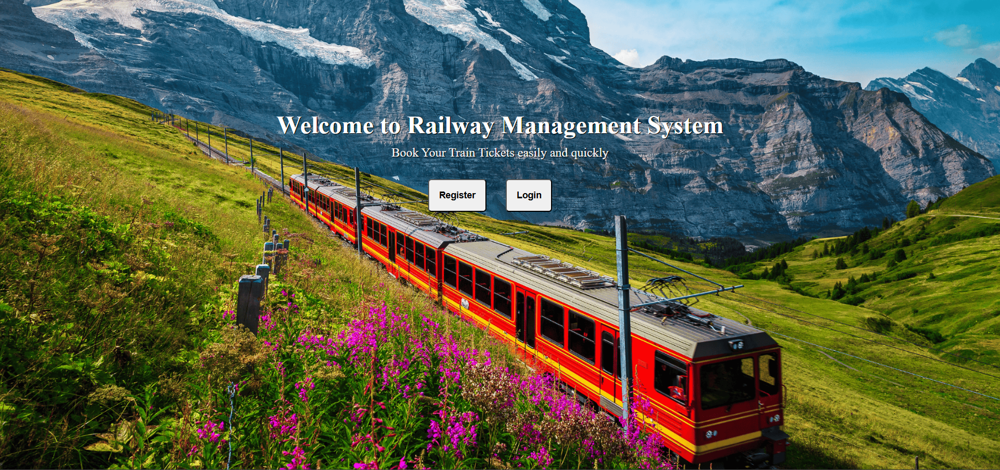

### Register Page

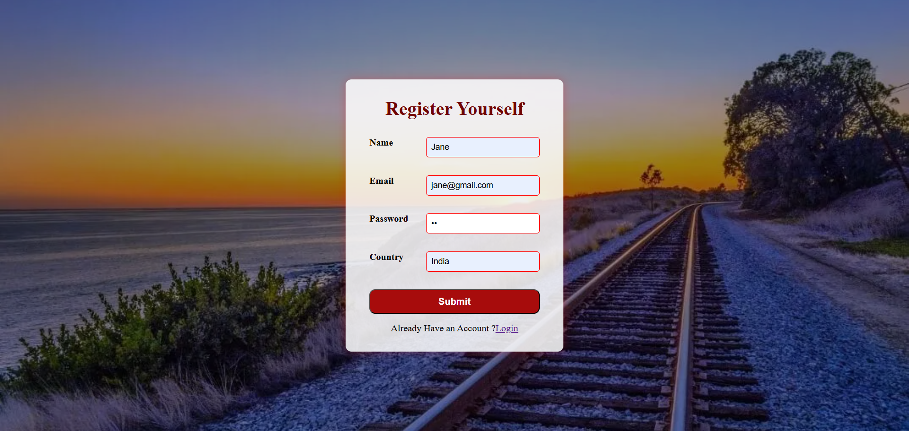

### Login Page

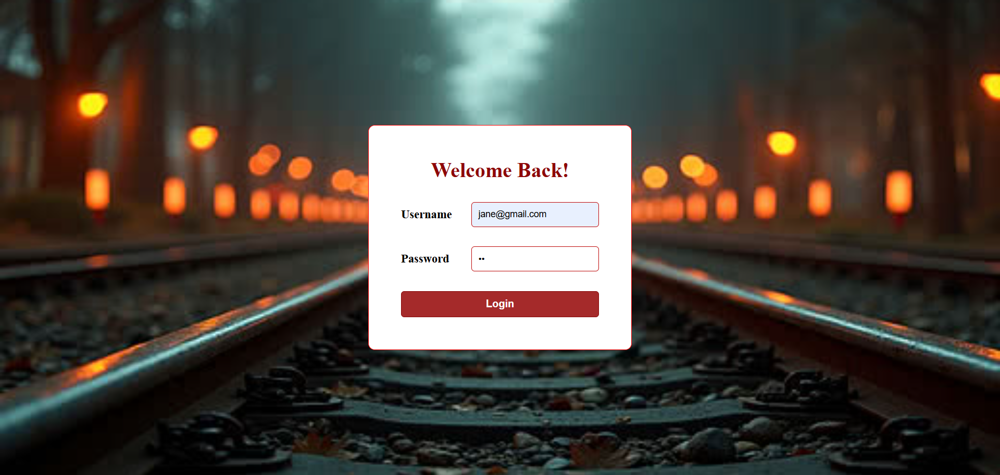

### Home Page

Book Page

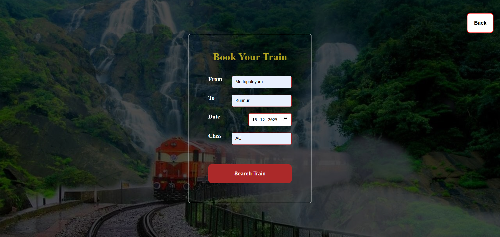

Search Results Page

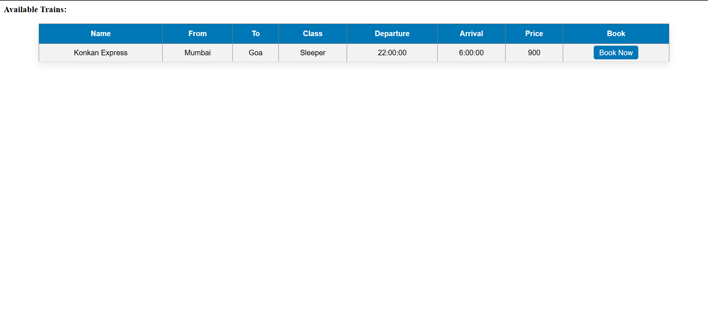

Payment Summary Page

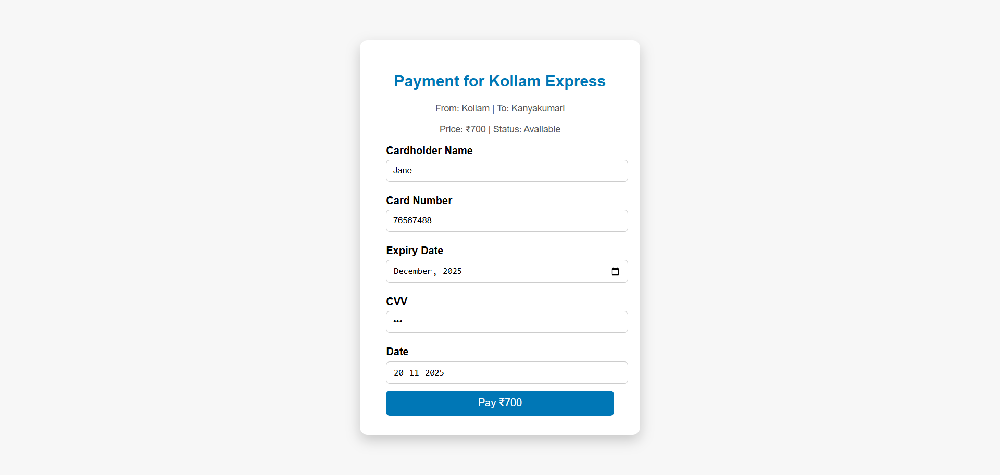

View Trains Page

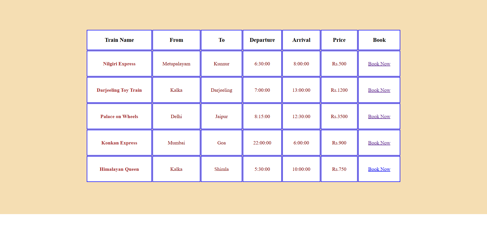

Explore Page

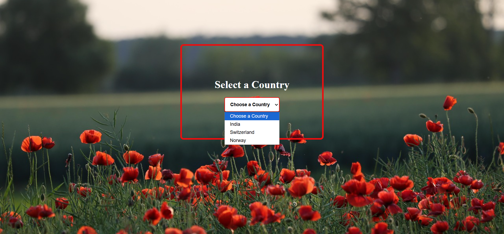

India Page

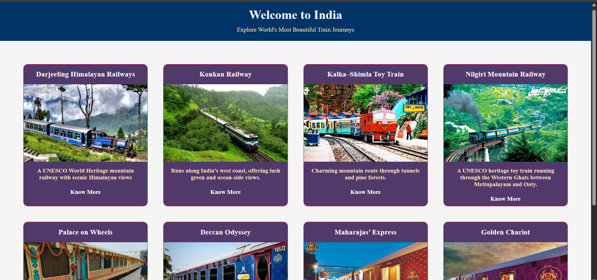

Switzerland Page

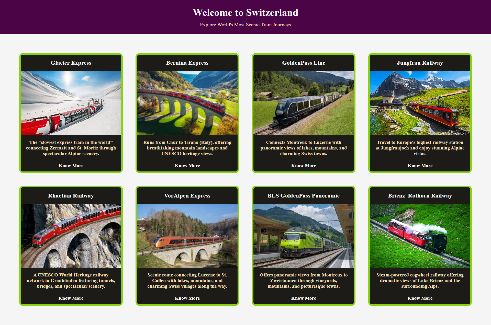

Norway Page

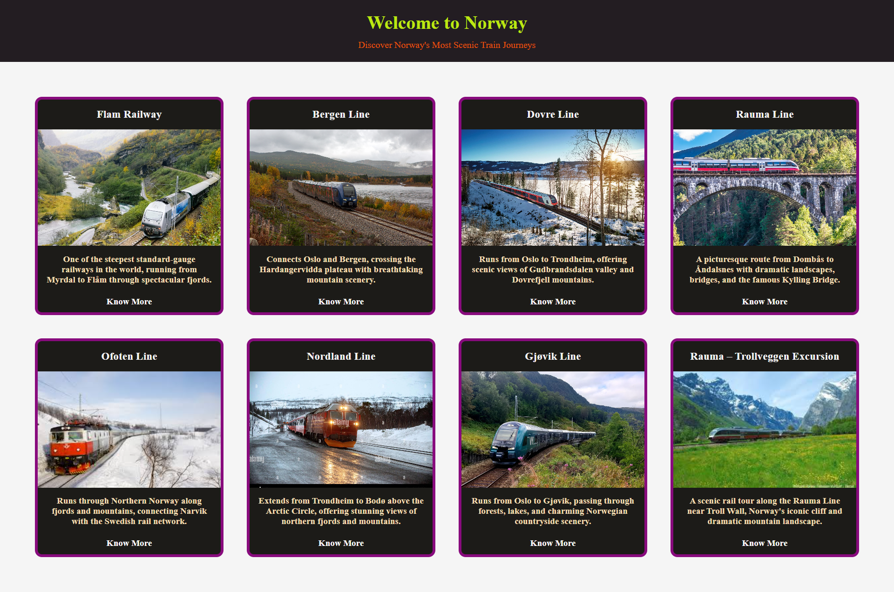

Admin Login Page

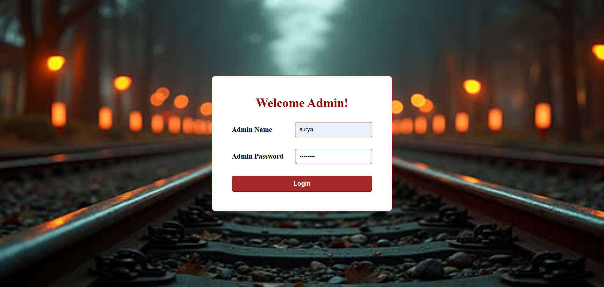

Admin Dashboard Page

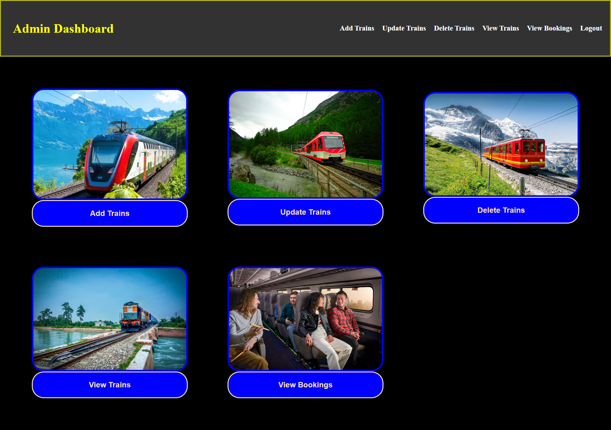

### Add Train Page

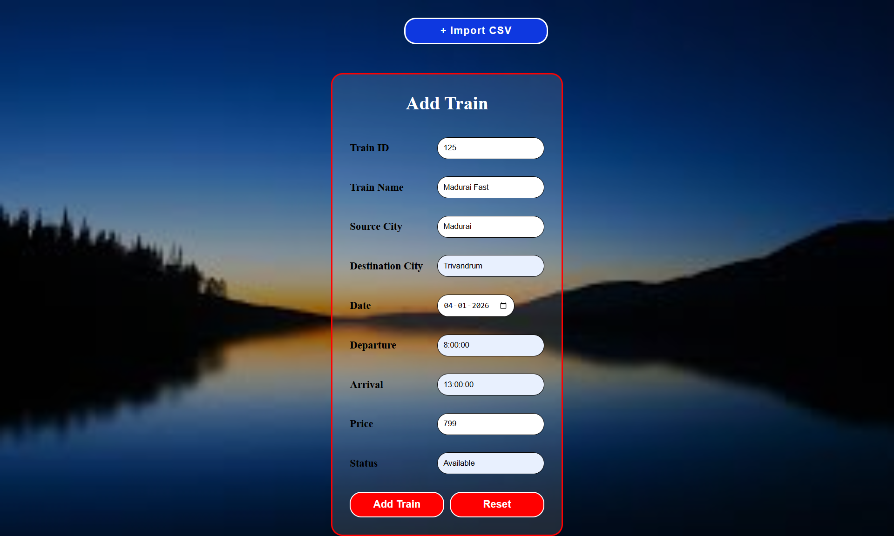

### Update Train Page

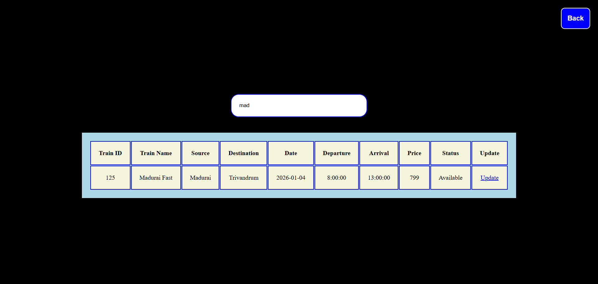

### Delete Train Page

### View Train Page

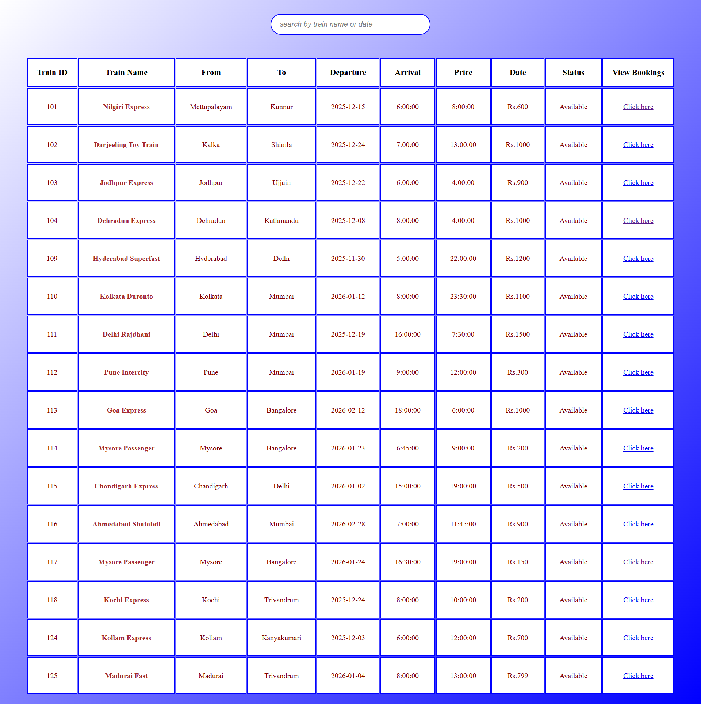

